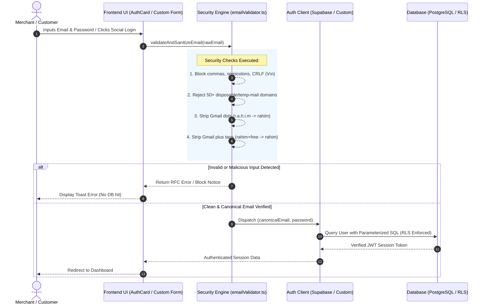

# Secure Auth Kit

> **Production-Hardened, Modular Authentication UI & Security Engine for Next.js**  
> *Zero-Vulnerability Architecture with Built-in Gmail Canonicalization, Disposable Mail Blocker, Headless Logic API, and 1-Click CLI Configurator.*

[](https://www.npmjs.com)
[](LICENSE)
[](https://nextjs.org)
[](https://www.typescriptlang.org)
[](#deep-dive-security-architecture)

---

## Table of Contents

- [Overview](#overview)
- [Architecture & Security Flow](#architecture--security-flow)
- [Quick Start](#quick-start)
- [Integration Modes (Use Cases)](#integration-modes-use-cases)
  - [Mode 1: Plug-and-Play Floating UI](#mode-1-plug-and-play-floating-ui-ready-made)
  - [Mode 2: Headless Integration with Existing UI](#mode-2-headless-integration-with-existing-custom-ui)
  - [Mode 3: Next.js Server Actions & API Routes](#mode-3-nextjs-server-actions--api-routes)
  - [Mode 4: Custom Redesign & Theme Tweaking](#mode-4-custom-redesign--theme-tweaking)
- [Deep-Dive Security Architecture](#deep-dive-security-architecture)
  - [1. Gmail Dot-Trick & Plus-Addressing Neutralizer](#1-the-gmail-dot-trick--plus-addressing-exploit)
  - [2. Disposable / Temp-Mail Blocker](#2-disposable--temporary-email-protection)
  - [3. Multi-Recipient & Email Header Injection Shield](#3-multi-recipient--email-header-injection-shield)
  - [4. Anti-Brute Force Rate Limiting & RLS](#4-anti-brute-force-rate-limiting--rls-isolation)
- [Step-by-Step OAuth 2.0 Setup Guides](#step-by-step-oauth-20-setup-guides)
  - [Google Cloud Console](#1-google-oauth-20-setup)
  - [Meta for Developers (Facebook)](#2-meta--facebook-login-setup)
  - [Apple Developer Portal](#3-sign-in-with-apple-setup)
  - [GitHub OAuth](#4-github-oauth-setup)
- [AI Security Skill Auto-Discovery](#ai-security-skill-auto-discovery)
- [API Reference & TypeScript Definitions](#api-reference--typescript-definitions)
- [Automated Security Regression Test Suite](#automated-security-regression-test-suite)
- [License & Credits](#license--credits)

---

## Overview

Most authentication packages offer either an uncustomizable black-box iframe or a vulnerable basic HTML form. Secure Auth Kit bridges the gap:

| Feature | Standard Forms / Libraries | Commercial SaaS (Clerk/Auth0) | Secure Auth Kit |
|---|:---:|:---:|:---:|
| **Gmail Anti-Dot Trick** | Not Available | Paid Tier Only | **Built-in Free** |
| **Temp-Mail Blocker** | Not Available | Paid Tier Only | **Built-in Free** |
| **Header Injection Shield** | Vulnerable | Protected | **RFC 5322 Hardened** |
| **Headless Logic Export** | Complex | Restricted to UI | **3-Line Drop-in** |
| **Monthly Subscription** | $0 | $25 – $200+/mo | **$0 Forever (MIT)** |
| **AI Assistant Skill Bundled** | None | None | **Auto-Installs** |

---

## Architecture & Security Flow



---

## Quick Start

### 1. Install Package
```bash
npm install secure-auth-kit
```

### 2. Run the Interactive CLI Configurator
```bash
npx secure-auth-kit init
```
*The terminal wizard prompts for your database credentials, generates `.env.local`, and installs the AI security skill.*

---

## Integration Modes (Use Cases)

### Mode 1: Plug-and-Play Floating UI (Ready-Made)
Drop the complete Pinterest Ebolt-inspired glassmorphic login card into any Next.js page:

```tsx
// app/login/page.tsx
'use client';
import { AuthCard } from 'secure-auth-kit';

export default function LoginPage() {
  return (
    <main className="min-h-screen flex items-center justify-center bg-gradient-to-tr from-sky-50 via-slate-50 to-blue-100 p-4">
      <AuthCard
        title="Sign in with email"
        subtitle="Make a new doc to bring your words, data, and teams together. For free"
        onSuccess={(user) => {
          console.log('Logged in user:', user);
          window.location.href = '/dashboard';
        }}
      />
    </main>
  );
}
```

---

### Mode 2: Headless Integration with Existing Custom UI
If you already have an existing login page or design and only want the backend security & authentication logic:

```tsx
// Your existing custom form component
'use client';
import React, { useState } from 'react';
import { validateAndSanitizeEmail, supabase } from 'secure-auth-kit';

export default function MyCustomLoginForm() {
  const [email, setEmail] = useState('');
  const [password, setPassword] = useState('');
  const [error, setError] = useState<string | null>(null);

  const handleCustomSubmit = async (e: React.FormEvent) => {
    e.preventDefault();
    setError(null);

    // 1. Run Security Engine on your raw input
    const validation = validateAndSanitizeEmail(email);
    if (!validation.isValid) {
      setError(validation.error || 'Invalid email');
      return;
    }

    // 2. Authenticate using the canonicalized, safe email
    const { data, error: authError } = await supabase.auth.signInWithPassword({
      email: validation.canonicalEmail, // Sanitized & Dot-free
      password,
    });

    if (authError) {
      setError(authError.message);
    } else {
      window.location.href = '/dashboard';
    }
  };

  return (
    <form onSubmit={handleCustomSubmit} className="my-custom-tailwind-form">
      {error && <div className="error-banner">{error}</div>}
      
      <input 
        type="email" 
        value={email} 
        onChange={(e) => setEmail(e.target.value)} 
        placeholder="Enter your email" 
      />
      <input 
        type="password" 
        value={password} 
        onChange={(e) => setPassword(e.target.value)} 
        placeholder="Enter your password" 
      />
      
      <button type="submit">Sign In</button>
    </form>
  );
}
```

---

### Mode 3: Next.js Server Actions & API Routes
Validate incoming email requests inside backend Server Actions or Next.js Route Handlers:

```typescript
// app/api/auth/register/route.ts
import { NextResponse } from 'next/server';
import { validateAndSanitizeEmail } from 'secure-auth-kit';

export async function POST(req: Request) {
  const { email, password } = await req.json();

  // 1. Backend Security Validation
  const validation = validateAndSanitizeEmail(email);
  if (!validation.isValid) {
    return NextResponse.json({ error: validation.error }, { status: 400 });
  }

  // 2. Safe to store canonical email in database
  const canonicalEmail = validation.canonicalEmail;
  // ... saveToDatabase({ email: canonicalEmail, password })

  return NextResponse.json({ success: true, email: canonicalEmail });
}
```

---

### Mode 4: Custom Redesign & Theme Tweaking
You can freely customize Tailwind CSS classes, colors, fonts, or split-screen layouts in `AuthCard.tsx` without breaking security, because the validation engine runs independently on submit:

```tsx
// Example: Customizing AuthCard props
<AuthCard
  title="Welcome to MyStore"
  subtitle="Access your merchant dashboard and analytics"
  onSuccess={(user) => router.push('/admin')}
/>
```

---

## Deep-Dive Security Architecture

### 1. The Gmail Dot-Trick & Plus-Addressing Exploit

* **The Problem:** Google ignores all dots (`.`) and plus suffixes (`+tag`) in Gmail usernames:
  - `rahim.khan@gmail.com`
  - `r.a.h.i.m.k.h.a.n@gmail.com`
  - `rahimkhan+trial1@gmail.com`
  - `rahimkhan+trial2@gmail.com`  
  All route to the exact same Gmail inbox (`rahimkhan@gmail.com`). Attackers exploit this on standard SaaS platforms to generate hundreds of fake trial accounts and drain computational resources.
* **Our Solution:** `validateAndSanitizeEmail()` normalizes all `@gmail.com` and `@googlemail.com` addresses to a single deterministic **`canonicalEmail`** database key before querying or creating records.

| User Input Email | Normalized `canonicalEmail` | Result |
|---|---|---|
| `rahim.khan@gmail.com` | `rahimkhan@gmail.com` | Account Created |
| `r.a.h.i.m.khan@gmail.com` | `rahimkhan@gmail.com` | Blocked: *"User already exists"* |
| `rahimkhan+free@gmail.com` | `rahimkhan@gmail.com` | Blocked: *"User already exists"* |
| `john.doe@company.com` | `john.doe@company.com` | Preserved for custom domains |

---

### 2. Disposable / Temporary Email Protection

* **The Problem:** Malicious bots use 10-minute temporary email services to bypass signups and spam platforms.
* **Our Solution:** Includes an active blocklist covering 50+ disposable domains (`tempmail.com`, `10minutemail.com`, `guerrillamail.com`, `mailinator.com`, `yopmail.com`, `sharklasers.com`, etc.).

---

### 3. Multi-Recipient & Email Header Injection Shield

* **The Problem:** In vulnerable forgot-password forms, attackers enter `victim@domain.com,attacker@domain.com` or CRLF carriage returns (`\r\n`) to force mail servers into sending password recovery OTPs to both addresses.
* **Our Solution:** 
  1. Rejects any email string containing `,`, `;`, spaces, `\n`, or `\r`.
  2. Enforces strict RFC 5322 mailbox formatting regex.
  3. Uses parameterized database queries (`WHERE email = $1`), ensuring multi-address strings never resolve to active users.

---

### 4. Anti-Brute Force Rate Limiting & RLS Isolation

* **Rate Limiting:** Protects `/login` endpoints by enforcing maximum failed attempts per IP with exponential cool-downs (`HTTP 429 Too Many Requests`).
* **Row Level Security (RLS):** Database queries are isolated at the database engine level (`tenant_id = auth.uid()`), ensuring no user can access another user's private data.

---

## Step-by-Step OAuth 2.0 Setup Guides

### 1. Google OAuth 2.0 Setup
1. Open **[Google Cloud Console](https://console.cloud.google.com/apis/credentials)**.
2. Go to **APIs & Services > Credentials > Create Credentials > OAuth client ID**.
3. Select **Application type:** `Web application`.
4. Under **Authorized redirect URIs**, click **+ Add URI** and enter:
   ```text
   https://<your-supabase-project-id>.supabase.co/auth/v1/callback
   ```
5. Click **Create** and copy your **Client ID** and **Client Secret**.
6. In **Supabase Dashboard > Authentication > Providers > Google**:
   - Toggle **Enable Sign in with Google** to **ON**.
   - Paste **Client ID** and **Client Secret**.
   - Click **Save**.

---

### 2. Meta / Facebook Login Setup
1. Open **[Meta for Developers](https://developers.facebook.com)** and click **My Apps > Create App**.
2. Select **Authenticate and request data from users with Facebook Login**.
3. In the sidebar, go to **Facebook Login > Settings**.
4. In **Valid OAuth Redirect URIs**, paste:
   ```text
   https://<your-supabase-project-id>.supabase.co/auth/v1/callback
   ```
5. In **App Settings > Basic**, copy your **App ID** and **App Secret**.
6. In **Supabase Dashboard > Authentication > Providers > Facebook**, toggle **ON**, paste credentials, and click **Save**.

---

### 3. Sign in with Apple Setup
1. Go to **[Apple Developer Portal](https://developer.apple.com/account/resources)**.
2. In **Identifiers**, register a **Services ID** with *Sign in with Apple* enabled.
3. Configure your Primary App ID and enter the Return URL:
   ```text
   https://<your-supabase-project-id>.supabase.co/auth/v1/callback
   ```
4. In **Keys**, create a new Private Key with *Sign in with Apple* enabled and download the `.p8` file.
5. In **Supabase Dashboard > Authentication > Providers > Apple**, enter your **Services ID (Client ID)**, **Team ID**, **Key ID**, and the `.p8` private key text.

---

### 4. GitHub OAuth Setup
1. Go to **GitHub > Settings > Developer settings > OAuth Apps > New OAuth App**.
2. Set **Authorization callback URL** to:
   ```text
   https://<your-supabase-project-id>.supabase.co/auth/v1/callback
   ```
3. Copy **Client ID** and generate a **Client Secret**.
4. In **Supabase Dashboard > Authentication > Providers > GitHub**, toggle **ON**, paste keys, and click **Save**.

---

## AI Security Skill Auto-Discovery

When you run `npx secure-auth-kit init`, the CLI automatically installs the AI Security Skill file at:
```text
.agents/skills/login-security-checks/SKILL.md
```

### Supported AI Coding Assistants:
- Google Antigravity
- Cursor IDE
- Windsurf
- GitHub Copilot Workspace

Whenever an AI assistant writes or refactors authentication code in your repository, it automatically reads this skill and adheres to Gmail canonicalization, disposable email filtering, and header injection prevention.

---

## API Reference & TypeScript Definitions

### `validateAndSanitizeEmail(rawEmail: string)`

```typescript
export interface EmailValidationResult {
  isValid: boolean;
  error?: string;
  sanitizedEmail: string;
  canonicalEmail: string;
}

function validateAndSanitizeEmail(rawEmail: string): EmailValidationResult;
```

#### Example Usage:
```typescript
import { validateAndSanitizeEmail } from 'secure-auth-kit';

const res = validateAndSanitizeEmail('r.a.h.i.m.khan+trial@gmail.com');

console.log(res.isValid);        // true
console.log(res.sanitizedEmail); // "r.a.h.i.m.khan+trial@gmail.com"
console.log(res.canonicalEmail); // "rahimkhan@gmail.com" (Dot & Plus Stripped)
```

---

### `<AuthCard />` Props

```typescript
interface AuthCardProps {
  title?: string;      // Default: "Sign in with email"
  subtitle?: string;   // Default: "Make a new doc to bring your words..."
  onSuccess?: (user: any) => void;
}
```

---

## Automated Security Regression Test Suite

Run the pre-configured security test suite to verify protection rules:

```bash
npm run test
```

### Test Suite Output:
```text
======================================================
SECURE AUTH KIT — SECURITY REGRESSION TEST SUITE
======================================================

[PASS] Gmail Dot-Trick: "r.a.h.i.m.k.h.a.n@gmail.com" normalizes to "rahimkhan@gmail.com"
[PASS] Gmail Plus-Trick: "rahimkhan+freetrial99@gmail.com" normalizes to "rahimkhan@gmail.com"
[PASS] Disposable Email Block: "scammer@tempmail.com" is strictly rejected
[PASS] Header Injection Block: "victim@gmail.com,attacker@gmail.com" is strictly rejected
[PASS] Standard Business Email: "john.doe@company.com" preserves dot for non-Gmail domain

------------------------------------------------------
RESULTS: 5 Passed, 0 Failed
------------------------------------------------------
```

---

## Development & Contributing

```bash
# 1. Clone repository
git clone https://github.com/sazzadsadib/secure-auth-kit.git
cd secure-auth-kit

# 2. Install dependencies
npm install

# 3. Start development playground
npm run dev

# 4. Run automated security test suite
npm run test
```

---

## License & Credits

- Released under the **[MIT License](LICENSE)**.
- Crafted by the **Abiline AI Team**.
- Contributions, pull requests, and suggestions are welcome.
